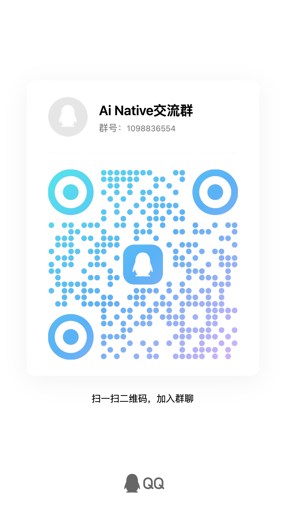

> 开发、issue、PR 和发版统一在本仓库维护，包含 gateway 源码。默认分支可能包含未发布改动；npm 安装的是最新已发布版本。开发见 [CONTRIBUTING.md](CONTRIBUTING.md)，发版见 [发布指南](docs/release.md)。BSL 许可证保持不变。

<p align="center">
  
</p>

# Hive

<p align="center">
  
</p>

**Hive 是浏览器里的 Agent 协作工作台——一群 Agent 在你本机各自开工，一个当 Orchestrator 派活、归总进展，其余各司其职。** Orchestrator 本身就是一个真实的 `agy` / `claude` / `codex` / `opencode` / `gemini` / `hermes` / `qwen` / `pi` 进程——不是你、也不是脚本——它派单的 Worker 同样是真 CLI agent。所有 agent 都是本机真实的 PTY 进程，通过 Hive 注入到 shell 里的小型 `team` 协议互相通信，共享 `<workspace>/.hive/tasks.md` 这份 markdown 任务图。

写代码、做调研、起草文档、做翻译——凡是能拆给一群人协作的脑力活，都可以让一群 Agent 合伙干。

全程可以用国产 CLI 组队——Qwen Code 是内置预设，GLM 等国内模型也能通过其支持的 coding CLI 或自定义命令接入——不强制依赖境外 API。Windows 原生支持（非 WSL），详见[平台支持](#平台支持)。

[](https://www.npmjs.com/package/@tt-a1i/hive)
[](https://github.com/tt-a1i/hive/actions/workflows/release.yml)
[](https://hivehq.dev)
[](https://nodejs.org/)
[](./LICENSE.BSL)
[-lightgrey.svg)](#平台支持)

🌐 **官网**：[hivehq.dev](https://hivehq.dev/)（[English](https://hivehq.dev/en/)）

[English](./README.md) · 简体中文

> Hive 是本机优先的工具，只监听 `127.0.0.1`，面向已经在用 CLI Agent 的人。最新稳定版本见 [npm](https://www.npmjs.com/package/@tt-a1i/hive)，上面的 badge 会指向它。

<p align="center">
  
</p>

## 为什么需要 Hive

CLI Agent 各自都很强，但同时管几个就有点别扭：

- 长任务的会话散在好几个终端里，注意力来回切。
- 想把活儿分给几个 Agent（写代码 / review / 测试，或者调研 / 起草 / 事实核查之类），却缺一层来居中调度。
- Worker 的进度淹在 scrollback 里，回头看找不到。
- 想重启接着干，全看每个 CLI 自己的 session 恢复行为，散乱不可控。

Hive 加上这一层调度，**不替换**任何 CLI。Agent 还是真实跑在你电脑上的终端进程，Hive 只是它们外面的"团队 shell"。

## 三个开箱场景

**带 reviewer 发一个 PR**

让 Orchestrator 先拆任务，再派一个 worker 实现、一个 worker review。实现、反馈、返工和最终汇报都留在同一个 workspace 里，不用在几个终端之间来回找上下文。

```text
修复设置页搜索 bug。派一个 worker 实现，再派一个 reviewer 检查边界情况，最后汇总还能不能合。
```

**并行排查一个疑难 bug**

把同一个问题拆成几条线：server 链路、UI 链路、最近提交、复现路径分别交给不同 worker。你看的是逐条 report 回流，而不是手动盯四个终端。

```text
排查移动端 reconnect 偶发卡住。把 server transport、浏览器 UI 和最近提交历史拆给不同 worker。
```

**调研、起草、事实核查一条龙**

一个 worker 找资料，一个 worker 起草，一个 reviewer 核对命令、文件路径和结论。任务图和汇报都可追踪，不会散在 chat scrollback 里。

```text
写一篇 release flow 技术说明。一个 worker 收集证据，一个起草，一个核对每个命令和文件引用。
```

## 先看看 demo

还没装任何 agent CLI？运行 `hive`、打开它打印出的本地地址、在 first-run 向导里点 **Try Demo**。当前 demo 是纯客户端回放：假终端会演示规划、`team spawn`、`team send`、worker report 回流和 `.hive/tasks.md` 打勾。不需要联网、不需要安装或登录任何真实 CLI，也不会访问 demo workspace 的后端路由。

## 快速开始

前置条件：

- Node.js 22.18+（22.x）或 24+
- 至少一个支持的 Agent CLI 已经安装好、登录过、在 `PATH` 上可调用

安装并启动 Hive：

```bash
npm install -g @tt-a1i/hive
hive
```

国内网络从 npmmirror 镜像安装更快：

```bash
npm install -g @tt-a1i/hive --registry=https://registry.npmmirror.com
```

Hive 使用 Node 内置 SQLite 和随包分发的 PTY 平台二进制。npm 12 默认配置或 `--ignore-scripts` 下都能安装使用，无需批准安装脚本或准备编译工具。请保留 optional dependencies，让 npm 安装当前平台对应的二进制。

打开终端打印出来的本机地址，通常是 `http://127.0.0.1:9483/`。如果你想让系统自动分配一个空闲端口，可以用 `hive --port 0`。

升级到最新版本：

```bash
hive update
```

`hive update` 使用 `--ignore-scripts` 安装新版本，并保留原 npm prefix，不修改用户的 npm 脚本策略。安装后会用当前 Node 启动独立进程验证 SQLite 与真实 PTY，失败不会提示更新成功。升级后重启 Hive。如果使用 pnpm / yarn 安装，请用相同包管理器升级。

把 Hive 装为应用（可选）：

在 Chrome / Edge / Brave 里打开 `http://127.0.0.1:9483/`，点浏览器地址栏右侧的安装图标即可。装好后 Hive 会以独立窗口启动、有自己的 dock 图标，且 dock 右键菜单上会显示 **添加 Workspace** / **试用演示** 两个快捷入口。Firefox 和 Safari 暂未实现 PWA install-prompt 协议，浏览器地址栏的安装图标只在 Chromium 系浏览器里出现。

PWA 只是 UI 壳，Hive 后端仍需要在终端里跑着。如果启动 PWA 时后端没起，会看到 “Hive 后端未启动” 页面，等你跑起 `hive` 后会自动刷新。PWA 的 install scope 按 origin（含端口）划分，所以 `hive --port 9484` 跟 `hive --port 9483` 在浏览器看来是两个独立应用。卸载方法：浏览器地址栏访问 `chrome://apps`，右键 Hive 图标，选 **从 Chrome 中移除…**。

关闭 PWA 窗口或 tab 时 Hive 会主动请求浏览器弹原生确认对话框，避免关闭快捷键（macOS 上是 Cmd+W、Windows / Linux 上是 Ctrl+W）误关丢失会话。但现代浏览器要求你跟页面"交互过"（点击 / 滚动 / 输入）才会真的弹这个对话框——刚打开 PWA 立刻按关闭快捷键仍会直接关闭，这是浏览器策略，不是 Hive 的 bug。

首次使用流程：

1. 选择一个项目目录作为 workspace。
2. 挑一个 Orchestrator 预设。
3. Hive 会创建 `<workspace>/.hive/tasks.md`，启动 Orchestrator 的 PTY，把内部的 `team` 命令注入这个 agent 会话。
4. 在 Team Members 面板里添加 Worker。
5. 跟 Orchestrator 说一声让它派活，它会用 `team send <worker-name> "<task>"` 发任务，Worker 完事后用 `team report` 回报。

想试更强的自动化，可以在右上角设置里开启实验性的 **Workflow** 开关。开启后，Orchestrator 可以编写并运行多 agent workflow，把一个目标拆成 fan-out / review / test 等阶段；顶部的 **Workflows** 面板会显示运行记录、阶段结果、定时任务和停止按钮。Workflow 创建的新 agent 默认使用哪种 CLI、允许使用哪些 CLI，也可以在 Workflows 面板里配置。

## 工作方式

```text
浏览器 UI 跑在 127.0.0.1
  任务 · 团队 · 终端 · 汇报
          |
          | HTTP + WebSocket
          v
Hive Runtime
  SQLite 元数据 · PTY 生命周期 · 任务派单
          |
          +-- Orchestrator PTY
          |     可调用：team send、team list、team report
          |
          +-- Worker PTY
          |     可调用：team report
          |
          +-- Worker PTY
                可调用：team report

Workspace 任务图：
  <workspace>/.hive/tasks.md
```

三个细节值得记住：

- Agent 是真正的 CLI 进程，不是模拟的 subagent。
- `team` 命令**只**在 Hive 管理的 agent 会话里可用——通过把包内 bin 目录 prepend 到 PATH 实现，不会装成全局命令。
- 任务图就是 workspace 里的一份 markdown 文件，你可以在编辑器里直接看或者改。

## Agent 预设

| 预设 | `PATH` 上的命令 | 默认 bypass 模式 | 会话恢复 |
| --- | --- | --- | --- |
| Antigravity CLI | `agy` | `--dangerously-skip-permissions` | `--conversation <session_id>` |
| Claude Code | `claude` | `--dangerously-skip-permissions`、`--permission-mode=bypassPermissions` | `--resume <session_id>` |
| Codex | `codex` | `--dangerously-bypass-approvals-and-sandbox` | `resume <session_id>` |
| OpenCode | `opencode` | 由 `~/.config/opencode/opencode.json` 配置 | `--session <session_id>` |
| Gemini | `gemini` | `--yolo` | `--resume <session_id>` |
| Hermes | `hermes` | `--yolo` | `--resume <session_id>` |
| Qwen Code | `qwen` | `--approval-mode yolo` | `--resume <session_id>` |
| Pi | `pi` | `--approve` | 暂未自动捕获 session id |
| Cursor CLI | `cursor` | `--force` | 暂未自动捕获 session id |
| Grok Build | `grok` | `--always-approve` | 暂未自动捕获 session id |
| 自定义 | 任意可执行文件 | 自己配 | 自己配 |

Hive 不替你安装这些 CLI。请在启动 Hive 的同一个 shell 环境里先装好、登录好。

### CLI 支持分级

| 分级 | CLI | 承诺 |
| --- | --- | --- |
| Tier 1 | Claude Code、Codex | CI 生成最小兼容报告（`pnpm compat:cli:report`）：检查 Node 22.18+、内置 SQLite、预编译 PTY，并在本机已安装 CLI 时记录版本。 |
| Tier 2 | Gemini、OpenCode、Qwen Code、Hermes、Pi、Cursor CLI、Grok Build、Antigravity CLI | 内置 preset + 手动 smoke 覆盖；上游 CLI 行为变化可能需要用户报告后再跟进。 |
| Custom | 任意可执行命令 | 用户自己维护命令、参数和登录状态；Hive 只保证 PTY/session 包装，不承诺 CLI 专属兼容性。 |

如果自定义启动命令包装的是已支持的 CLI，填写命令时请保留对应 CLI 预设，
让 Hive 使用它的启动提示和交互输入策略。没有关联已识别预设的任意可执行程序
可以在 PTY 中运行，但不会自动注入角色和启动指引。

## Hive 提供什么

- Workspace 侧边栏，方便在多个本机项目之间切换。
- Orchestrator 和 Worker 终端都是真实 PTY 支撑的。
- Add Worker 预置 coder / reviewer / tester 等角色模板，也支持完全自定义 prompt 与命令——把任何 CLI agent 编排成你需要的角色。
- Workflows（实验性，默认关闭）：Orchestrator 可以运行多阶段、多 agent 的 workflow，Hive 在 Workflows 面板里展示运行、日志、结果、定时任务和停止控制。
- Workflow CLI 策略：为 workflow 创建的 agent 选择默认 CLI，并限制允许使用的 CLI，避免脚本误启未配置的 agent。
- `.hive/tasks.md` 编辑器，带外部文件冲突处理。
- PTY 后台保留；对已配置 session capture 的预设，尽力使用对应 CLI 的原生 session 恢复。
- 升级后的 What's New 弹窗，用简短 release highlights 告诉你新版改了什么。
- 元数据存在本机 SQLite，Windows 默认在 `%APPDATA%\hive`，macOS / Linux 默认在 `~/.config/hive`，也可以通过 `$HIVE_DATA_DIR` 指定。

Hive **不**提供 sandbox 隔离、多用户认证，也不自带任何 agent 模型。它只负责调度你已经在用的本机 CLI。

## 远程访问（可选，默认关闭）

如果想在外面用手机查看、操作正在本机跑着的 Hive，可以开启可选的 **Remote access**。开启后，手机浏览器在网关上用 GitHub / Google 登录、跟桌面完成一次配对，就能通过端到端加密隧道访问**完整**的 Hive Web UI——已配对的手机是与本地浏览器**等权**的受信任设备。

需要清楚的几点：

- **默认关闭**。不开就没有任何出站连接、没有监听，行为跟现在一模一样。
- **需要一个网关**。隧道要经过一个网关中转（你本机的 daemon 主动出站连它，不开端口、不动路由器）。网关地址可配置：可以 **自己 self-host** 一个 Cloudflare Workers 网关，也可以接一个已部署的网关。Hive **没有**现成的一键托管服务——这一步要你自己搭。
- **数据和执行永远在本机**。网关只做身份（OAuth 登录）和路由，看不到明文——它只转发密文。网关挂了，本机 `127.0.0.1` 上的一切照常。
- **端到端加密**。手机 ↔ daemon 之间所有数据帧端到端加密，网关只见密文和路由头。诚实的边界：手机端的加密代码由网关分发（web 端 E2E 的经典局限，跟 Proton / WhatsApp Web 同类），缓解手段是 SRI + 版本化 bundle + PWA 缓存形成 TOFU。我们不宣传"网关被攻破也绝对安全"。
- **信任根在桌面**。新设备配对必须人在电脑前确认（桌面弹窗 + 6 位 SAS 短码校验）；已配对手机不能凭自己批准新设备。设备随时可吊销。

完整的开启、登录（`hive remote login`）、配对、吊销和 self-host 网关步骤见 [docs/remote-access.md](docs/remote-access.md)。

## 平台支持

| 平台 | 状态 | 说明 |
| --- | --- | --- |
| macOS | Tier 1 | 主要开发与发版验证平台。 |
| Linux | Tier 1 | CI 验证。原生目录选择器依赖 `zenity`，没有也可以手动粘贴路径。 |
| Windows | Tier 2 | **原生支持，无需 WSL**。CI 在 `windows-latest` 跑 `pnpm test:windows`、打包安装冒烟和 `pnpm compat:cli:report`，用于提前发现 SQLite / PTY 运行时问题；包内含 `team.cmd`。 |

支持 macOS、Windows、glibc Linux 的 x64 和 arm64，要求 Node.js 22.18+（22.x）或 24+。SQLite 随 Node 提供，PTY 二进制作为平台依赖直接安装，无需本机编译。目前不支持 Alpine/musl 或其他架构。

## 安全模型

Hive 是本机开发工具，**不是**托管服务。

- Runtime 只监听 `127.0.0.1`。不要把 Hive 端口通过公网隧道、反向代理或任何共享网络接口暴露出去。
- 内置预设会主动传 CLI 的 non-interactive / bypass flag。Worker 在选中的 workspace 里有跟启动 shell **同等**的执行权限——把它当成"会自动跑命令的你自己"。
- 只打开你信任的 workspace。Worker 拥有跟你登录账户一样的文件系统访问权限。
- Agent token 是 session 级的，由本机 runtime 生成，注入到 agent 进程环境变量里，**不**用于跨网络通信。
- Hive 不做多用户认证。任何能从本机访问到端口的进程都视为可信本地访问。
- 浏览器 UI token 只是本机会话保护，不是用来防同一系统账户下其他进程的安全边界。

在敏感仓库里用 Hive 之前，请先读 [SECURITY.md](SECURITY.md)。

## 数据位置

| 数据 | 位置 |
| --- | --- |
| Runtime 元数据 | Windows: `%APPDATA%\hive`；macOS / Linux: `~/.config/hive`；或 `$HIVE_DATA_DIR` |
| Workspace 任务图 | `<workspace>/.hive/tasks.md` |
| 内部 `team` 命令 | 包内 `dist/bin/`，通过 PATH 注入 PTY |
| Web UI 资源 | 由 runtime 从包内 `web/dist` 直接服务 |

## 故障排查

**找不到 Agent CLI**

确认选中的命令已经安装好、登录好、在启动 Hive 那个 shell 里能直接调用，且在 `PATH` 上。

**端口被占用**

换个本机端口启动：

```bash
hive --port 4020
```

**缺少平台二进制**

确认 Node.js 为 22.18+（22.x）或 24+，并使用受支持的平台。不要使用 `--omit=optional`，也不要跨操作系统复制 `node_modules`；PTY 包在安装时按平台选择。保留 optional dependencies 后重新安装 Hive，无需授权安装脚本或安装 C++ 编译器。

旧安装若提示缺少 `better-sqlite3` bindings，可通过 npm 安装当前 Hive 版本；已有 Hive SQLite 数据保留。

**Linux 上目录选择器不弹**

装 `zenity`，或者直接在对话框里粘路径。

**Windows 上目录选择器**

Windows 版默认使用浏览器内的服务器文件系统浏览器来添加 Workspace，不再弹 PowerShell 原生目录选择器。浏览器会从“此电脑”开始列出可访问盘符，所以可以进入 `C:\`、`D:\` 等其他盘；如果目标目录不在浏览器列表里，可以展开“高级：粘贴路径”直接输入绝对路径。

**Tasks 文件冲突 banner 出现**

Hive 检测到磁盘上的 `.hive/tasks.md` 比 UI 里的新。`Reload` 接受磁盘版本，`Keep Local` 保留 UI 编辑并覆盖保存。

**Worker 卡在 `working` 状态**

Hive 不通过进程活动猜测任务完成。Worker 只有在调 `team report` 时才会回到 `idle`。如果它确实卡了，从 UI 里 Stop 或 Restart。

## 开发

```bash
pnpm install
pnpm dev
```

开发模式下 runtime 跑在 `127.0.0.1:9483`，Vite 跑在 `127.0.0.1:5180`，把 API 和 WebSocket 代理到 runtime。

常用命令：

```bash
pnpm check
pnpm build
pnpm test
```

预演 production 构建：

```bash
pnpm build
node dist/src/cli/hive.js --port 9483
```

Production 模式下 runtime 直接服务构建好的 web UI，不需要单独的 Vite。

## 发布

维护者本地预演：

```bash
pnpm release:dry
```

完整 tag 发版清单见 [docs/release.md](docs/release.md)，里面包含 Windows 手动 smoke 步骤。

带 `v*` 的 tag push 会触发 GitHub Actions release workflow。workflow 会在 macOS、Ubuntu、Windows 三平台验证，然后用 `NPM_TOKEN` 发布到 npm。

## 状态

Hive 目前处于 alpha 阶段，核心流程已可用。当前重点是继续打磨多 Agent 协作体验、Windows 支持和更清晰的调度可观测性。欢迎试用、提 issue——反馈会直接影响后续节奏。

## 交流群

有问题、想反馈，或者就想聊聊 Agent 协作，欢迎进 QQ 群：**Ai Native 交流群**（群号 `1098836554`）。

<p align="center">
  
</p>

## 在路上：跨 Agent 的长时记忆

<p align="center">
  <a href="https://github.com/EverMind-AI/EverOS">
    
  </a>
</p>

单 agent 现在已经各有各的"记忆"了——但风格其实差很多：

- **Claude Code 的 [Auto Dream](https://claudefa.st/blog/guide/mechanics/auto-dream)（俗称"做梦"）** 走 **离线批处理** 路线：`/dream` 触发（或 24h 自动），Claude 在云端把 JSONL 会话归并去重抽模式，产出新版本 memory 库给你审查再采纳——像人类的 REM 睡眠，**清醒 / 睡眠二相**。
- **Hermes Agent** 反过来走 **嵌入式 / 在场** 路线：不睡，每 N 轮对话后台 fork 一个 sub-agent review，结果直接落进本地的 **多层记忆**——`MEMORY.md`（事实/规则）·`USER.md`（用户画像）·SQLite + FTS5（情景检索）·Honcho（第三人称表征）·`skills/`（程序性记忆）——而且 agent 允许边走边改自己的 skill 文件，记忆和能力是一回事。

但 **这些都是单 agent 内部的记忆**。Hive 是多 agent 协作工作台，正在把它们打通：让整支团队 **共享一座长时记忆库**——Worker A 今天踩的坑，明天 Orchestrator 派给 Worker B 时能自动调来当上下文。

第一阶段先走本地优先：Hive 用 SQLite 保存协作历史和显式团队记忆，支持 `team recall` / `team memory`、派单和恢复时的自动注入、`<workspace>/.hive/memory.md` 单向导出，以及 Dream 整理。Dream 会按 workspace 空闲和增量阈值创建维护 run，把有界协议窗口注入 Orchestrator；Orchestrator 可自己整理，或派 worker 只读评审并回报建议，最后由 Orchestrator 用 `team memory apply --run <id> --stdin` 提交去重/改写/归档/新增。每次 run 保留 diff 报告和回滚入口。

下一阶段再接 **[EverOS](https://github.com/EverMind-AI/EverOS)**（[EverMind](https://evermind.ai/) 出品的开源长时记忆 OS，目前在 LoCoMo / LongMemEval / HaluMem 三个记忆 benchmark 上 SOTA）这类外部 provider。EverOS 的四层架构（Agentic / Memory / Index / API+MCP）跟 Hive 的多 PTY 协作模型很搭：每个 agent 各跑各的 CLI session，团队级的事实和模式凝在 provider，Orchestrator 派单时一并喂给 worker。

进度跟踪：[#6](https://github.com/tt-a1i/hive/issues/6)——想看进度或提建议，在 issue 留 +1。

## 另一种形态：squad

如果你更喜欢 **纯 CLI、零后台进程、能直接在 SSH 进的远端服务器上跑** 的形态，[squad](https://github.com/mco-org/squad) 是同一个想法的另一条路线——SQLite 当通信层，每个 agent 各自开一个终端。两个项目互不替代，按工作流挑就行：

- **Hive** — 想要可视化工作台、一键重启、侧边栏切 workspace、给团队演示
- **squad** — 活在 tmux 里、SSH 远端开发、不想跑额外后台进程、Windows server

## 鸣谢

Hive 的"模板市场"内置了两份社区角色 prompt 库的快照，两份都按各自上游的 MIT 许可分发：

- 英文版（界面切到 EN 时使用）：[`msitarzewski/agency-agents`](https://github.com/msitarzewski/agency-agents)
- 中文版（界面切到中文时使用）：[`jnMetaCode/agency-agents-zh`](https://github.com/jnMetaCode/agency-agents-zh)

上游内容未做修改，许可证文本保留在 `vendor/marketplace/<lang>/LICENSE`；快照通过 `pnpm sync:marketplace` 在 hive 发版前刷新。

## License

Hive 是 **source-available（源码可得）** 项目，以 **Business Source License 1.1（BUSL-1.1）** 提供源码。它**不是** OSI 定义的开源（open source）许可，我们也不自称开源项目。

### License FAQ

**为什么不是 OSI 开源？** BUSL-1.1 对生产使用附带一条限制（见下条），不满足开放源代码定义的要求——BUSL 许可文本自己也写明它 "is not an Open Source license"。与其模糊表述，我们选择如实写 source-available。

**个人 / 团队日常使用受影响吗？** 不受影响。[LICENSE.BSL](LICENSE.BSL) 的 Additional Use Grant 明确允许生产使用，唯一例外是：以收费或其他营收安排（含付费支持等）向第三方提供托管 / 嵌入的 Hive、且与 Hive 的多 CLI agent 编排产品形成竞争。个人使用、组织内部部署、嵌入非竞争产品、非商业 fork 都不属于"竞争性产品"。

**以后会变开源吗？** 会。每个版本在 Change Date（2030-05-16）或该版本首次公开发布满四年（以先到者为准）自动转为 **Apache License 2.0**。

详细条款以 [LICENSE.BSL](LICENSE.BSL) 为准。Fork 或再分发版本必须保留 [NOTICE](NOTICE)、[LICENSE.BSL](LICENSE.BSL) 和相关许可证文件。Hive 名称、logo 和视觉识别不随源码许可证授权；品牌使用边界见 [TRADEMARK.md](TRADEMARK.md)。
